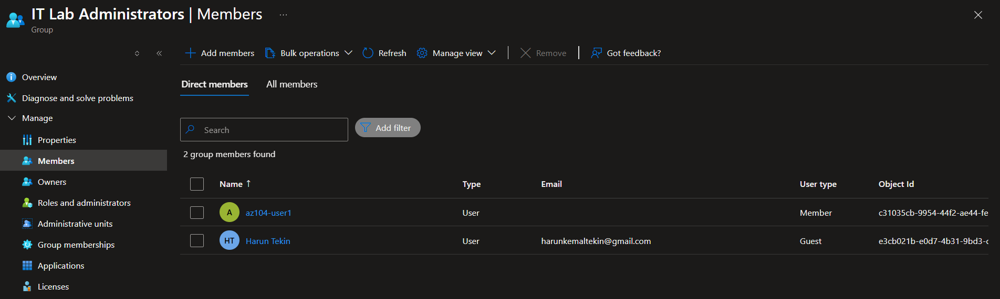
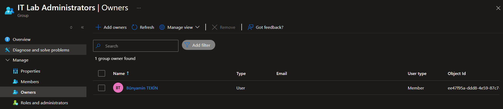

# Lab 01: Manage Microsoft Entra ID Identities

## 📌 Project Overview
In this lab, I established a pre-production testing environment identity structure using Microsoft Entra ID. The goal was to provision user accounts and configure group management for newly hired lab engineers, ensuring optimized administration with secure access controls.

## 🏗️ Architecture & Component Design
The identity architecture consists of the following components:
*   **Tenant:** Microsoft Entra ID instance.
*   **Internal User (`az104-user1`):** Cloud-native account designated as an IT Lab Administrator.
*   **External/Guest User:** Invited external partner account integrated into the organization's collaboration workflow.
*   **Security Group (`IT Lab Administrators`):** A centralized group utilized for managing permissions, containing both internal and guest identities.

---

## 🛠️ Skills and Tasks Demonstrated

### Task 1: User Provisioning & Management
*   **Internal User Creation:** Created `az104-user1`, specified administrative properties (Job Title: `IT Lab Administrator`, Department: `IT`), and assigned a Usage Location (United States) to comply with licensing requirements.
*   **B2B External Collaboration:** Invited a guest user into the tenant with identical metadata to simulate cross-company project testing environments.

### Task 2: Security Group Configuration
*   Created a **Security Group** named `IT Lab Administrators`.
*   Assigned explicit ownership to my administrative account for localized governance.
*   Implemented **Assigned (Static) Membership** by adding both the cloud-native and guest users to the group.

---

## 📸 Verification & Proof of Concept (PoC)

Here is the confirmation of successful resource deployment within the Entra ID tenant:

### 1. User Accounts Created Successfully
*Below, you can see both the internal administrator and the external guest account populated in the Entra ID user blade.*

### 2. Group Membership Verified
*This screenshot shows the 'IT Lab Administrators' group with its designated owners and members assigned properly.*

---

## 🧠 Key Takeaways & Lessons Learned
*   **Licensing Constraints:** While the production goal is to use *Dynamic Groups* based on Job Titles to minimize overhead, I observed that this automation requires an **Entra ID Premium P1 or P2 license**. In standard lab environments where this isn't available, static assignment serves as the fallback.
*   **Usage Location Importance:** Assigning a 'Usage Location' to user profiles is a critical step before mapping licenses (like Microsoft 365 or Azure P2), as many cloud services cannot be allocated to users without a designated region.