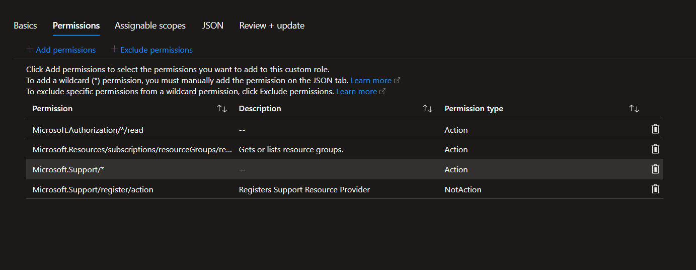
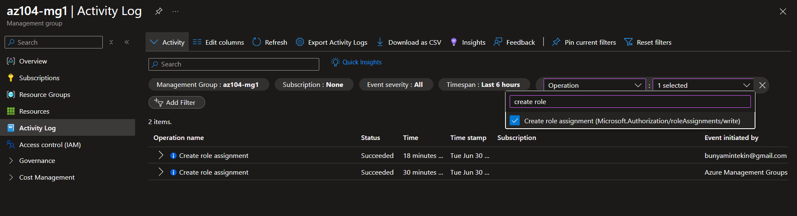

# Lab 02a - Manage Subscriptions and RBAC

## 📌 Project Overview
In this lab, I implemented enterprise-level governance and access management within Azure. The core objective was to structure management hierarchies using Management Groups and enforce the **Principle of Least Privilege (PoLP)** by deploying both built-in and highly customized Role-Based Access Control (RBAC) roles for a corporate Help Desk group.

## 🏗️ Architecture & Component Design
The access control design is structured around a centralized hierarchy to streamline management across multiple subscriptions:

*   **Management Group (`az104-mg1`):** Serves as a scope boundary above the subscription level to allow inherited role assignments.
*   **Built-in Role (Virtual Machine Contributor):** Allocated to allow full VM lifecycle management without exposing virtual network or storage controls.
*   **Custom RBAC Role (`Custom Support Request`):** Cloned from the standard support role but modified to restrict resource provider registrations.

---

## 🛠️ Skills and Tasks Demonstrated

### Task 1: Enterprise Management Group Hierarchy
*   Provisioned a dedicated Management Group (`az104-mg1`) beneath the Tenant Root Group to facilitate centralized governance.
*   Structured the hierarchy to prepare for seamless subscription linking and automated policy/role inheritance.

### Task 2: Built-in Azure Role Assignment
*   Navigated the Access Control (IAM) blade to audit existing cloud-native roles.
*   Assigned the **Virtual Machine Contributor** role to the `helpdesk` security group at the management group scope, ensuring all underlying resources inherit this access securely.

### Task 3: Custom RBAC Role Creation (Least Privilege)
*   Created a customized security role named `Custom Support Request` using the Azure Portal UI.
*   **Baseline Cloning:** Cloned the default `Support Request Contributor` role to use as a baseline.
*   **Granular Restriction:** Excluded specific high-level capabilities by defining `Microsoft.Support/register/action` as a `NotAction` within the custom role definition to prevent help desk staff from registering core resource providers.

### Task 4: Governance Auditing & Monitoring
*   Utilized the Azure **Activity Log** engine to filter, track, and monitor administrative tasks.
*   Validated the lifecycle of role definitions and security assignments (`Microsoft.Authorization/roleAssignments/write`) for compliance auditing.

---

## 📸 Verification & Proof of Concept (PoC)

Here is the technical verification of the access environment setup:

### 1. Custom Role Definition
*Below is the configuration interface used during the creation of the Custom Support Request role.*

### 2. Activity Log Governance Audit
*This screenshot shows the precise filtering inside the Activity Log to audit when and by whom role assignments were successfully written.*

---

## 🧠 Key Takeaways & Lessons Learned
*   **Inheritance Power:** Assigning roles at the Management Group scope drastically cuts down administrative overhead. Any future subscription dragged under `az104-mg1` automatically gains these exact helpdesk permissions.
*   **The Power of `NotAction`:** Understanding that custom roles shouldn't just contain what a user *can* do, but explicitly define what they *cannot* do (like blocking resource provider registration) is fundamental to preventing privilege escalation in cloud environments.