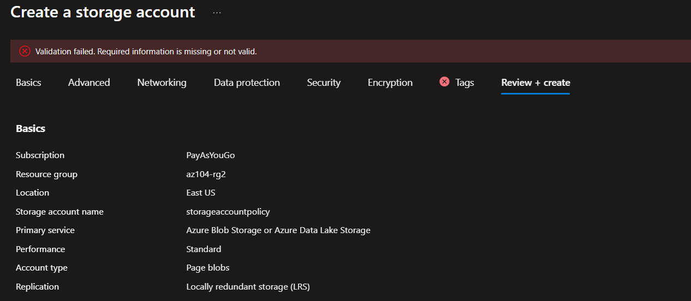
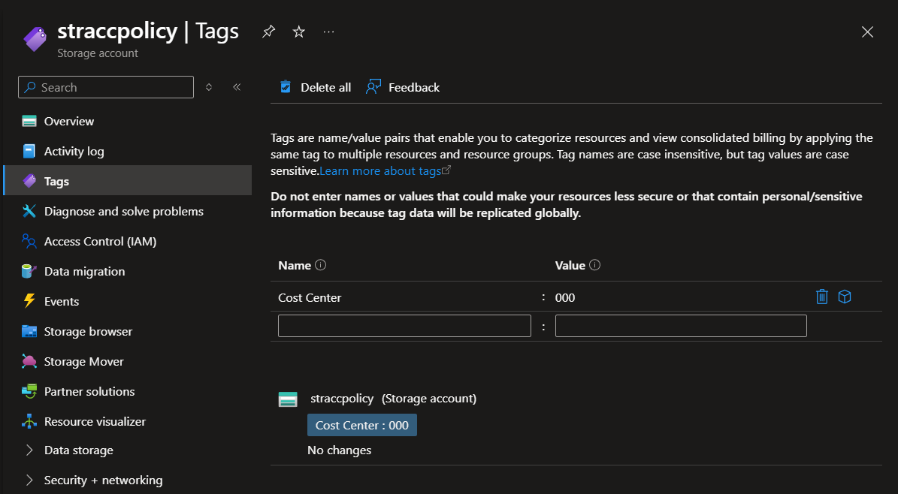
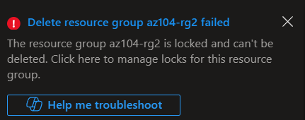

# Lab 02b: Manage Governance via Azure Policy and Resource Locks

## 📌 Project Overview
As a cloud environment expands, tracking resource ownership and preventing accidental deletion becomes critical. In this lab, I implemented cloud governance strategies by enforcing resource tagging standards through **Azure Policy**, automating compliance remediation, and protecting production-critical assets using **Resource Locks**.

## 🏗️ Governance Design & Architecture
The governance framework for this environment is established using three distinct compliance mechanisms:

1.  **Manual Tagging:** Applying metadata directly during resource deployment.
2.  **Azure Policy Enforcements:**
    * *Deny Effect:* Blocking any deployment that lacks the corporate `Cost Center: 000` tag.
    * *Modify Effect with Remediation:* Automatically inheriting the `Cost Center` tag from the parent Resource Group if a child resource is deployed without it.
3.  **Resource Locks:** Appending a `CanNotDelete` barrier to structural resource groups.

---

## 🛠️ Skills and Tasks Demonstrated

### Task 1 & 2: Proactive Governance via "Deny" Policies
* Created a baseline Resource Group (`az104-rg2`) populated with a `Cost Center: 000` metadata tag.
* Assigned the built-in policy definition: **"Require a tag and its value on resources"**.
* **Result:** Attempted to create a Storage Account without the designated tags. The deployment engine successfully intercepted and blocked the operation, throwing a validation failure due to non-compliance.

### Task 3: Automated Remediation via "Modify/Inherit" Policies
* Shifted to a more automated governance model by deploying the policy: **"Inherit a tag from the resource group if missing"**.
* Enabled a **Remediation Task** paired with an automatically provisioned Managed Identity to alter resource properties dynamically.
* **Result:** Deployed a new Storage Account without tags. The policy successfully executed a `Modify` operation post-validation, forcing the resource to inherit `Cost Center: 000` seamlessly from its Resource Group.

### Task 4: Accidental Deletion Protection via Resource Locks
* Configured a **Delete (CanNotDelete)** structural lock named `rg-lock` on the Resource Group level.
* **Result:** Attempted to purge the Resource Group. Azure Resource Manager (ARM) rejected the API call and explicitly threw an error notification, proving the asset cannot be deleted until an administrator intentionally removes the lock.

---

## 📸 Verification & Proof of Concept (PoC)

### 1. Policy Interception (Deny Effect)
*This error log indicates that the Azure ARM deployment engine successfully blocked a storage account creation due to missing corporate tags.*

### 2. Auto-Inherited Tags (Remediation Effect)
*Verification showing that the child Storage Account automatically inherited the 'Cost Center' tag via Azure Policy's remediation engine.*

### 3. Structural Lock Protection
*The system rejection notification captured when attempting to delete a resource group locked with a 'CanNotDelete' constraint.*

---

## 🧠 Key Takeaways & Lessons Learned
* **Policy Enforcement Latency:** Azure Policy evaluations aren't always instantaneous; it can take 5 to 10 minutes for newly assigned scope limits to replicate across the Azure fabric.
* **The Power of Managed Identities in Governance:** Policies with a `Modify` or `DeployIfNotExists` effect require an underlying Managed Identity. This is because Azure Policy needs explicit RBAC permissions to alter properties or deploy resources on your behalf during remediation tasks.
* **Lock Hierarchy:** Resource locks cascade downwards. A delete lock applied on a Resource Group automatically shields every single resource nested inside it, creating a foolproof guardrail against human error.