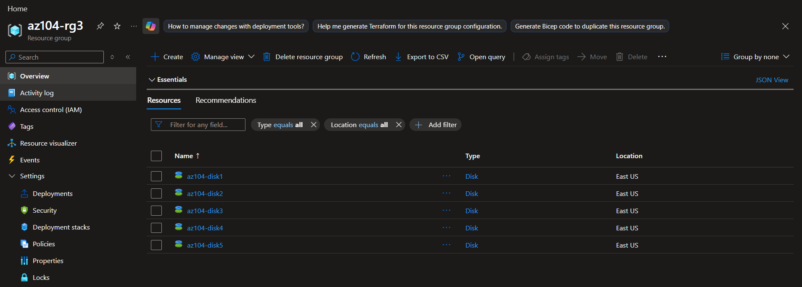
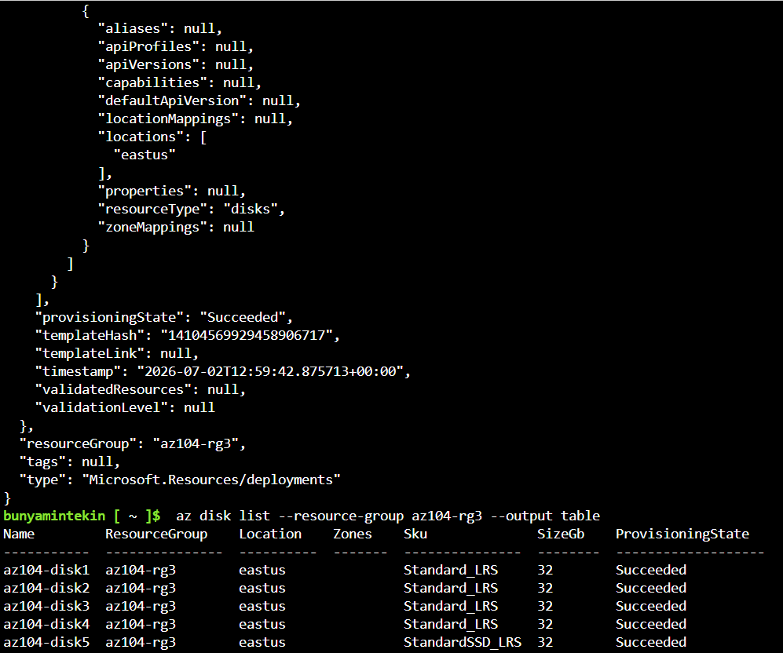

# Lab 03: Manage Azure Resources by using ARM and Bicep Templates

## 📌 Project Overview
Automation and consistency are key pillars of cloud administration. In this lab, I transitioned from manual resource creation to **Infrastructure as Code (IaC)**. I demonstrated how to eliminate human error and reduce administrative overhead by exporting, editing, and deploying cloud infrastructure using **ARM (JSON) Templates**, **Azure PowerShell**, **Azure CLI**, and **Azure Bicep**.

## 🏗️ Deployment Matrix
Throughout this lab, I successfully provisioned **5 distinct Managed Disks** inside the `az104-rg3` Resource Group, utilizing a different deployment method for each tier:

| Disk Name | Deployment Method | Tool Used | Template Technology | SKU / Size |
| :--- | :--- | :--- | :--- | :--- |
| `az104-disk1` | Azure Portal UI | Web Browser | Manual Execution | Standard HDD / 32 GB |
| `az104-disk2` | Custom Template Deployment | Portal Template Editor | ARM Template (JSON) | Standard HDD / 32 GB |
| `az104-disk3` | Azure Cloud Shell | Azure PowerShell Module | ARM Template (JSON) | Standard HDD / 32 GB |
| `az104-disk4` | Azure Cloud Shell | Azure CLI Engine | ARM Template (JSON) | Standard HDD / 32 GB |
| `az104-disk5` | Azure Cloud Shell (Bash) | Azure CLI Engine | **Azure Bicep (.bicep)** | Standard SSD / 32 GB |

---

## 🛠️ Skills and Tasks Demonstrated

### Task 1 & 2: Reverse Engineering & ARM Customization
* **Template Export:** Deployed the baseline disk (`az104-disk1`) via the portal and used the **Export Template** engine to reverse-engineer the underlying ARM JSON definition.
* **Parametrization & Refactoring:** Downloaded and refactored the structural `template.json` and `parameters.json` files to dynamically alter disk variables, successfully deploying `az104-disk2` via the Custom Template engine.

### Task 3 & 4: Multi-Shell Automation (PowerShell & CLI)
* Configured an ephemeral **Azure Cloud Shell** workspace to bridge multi-platform administrative workflows.
* **PowerShell Deployment:** Used `New-AzResourceGroupDeployment` to pipe parameters directly into the deployment engine for `az104-disk3`.
* **CLI Deployment:** Switched to a Bash interface and ran `az deployment group create` to provision `az104-disk4` programmatically.

### Task 5: Next-Gen IaC with Azure Bicep
* Uploaded and refactored a native **Azure Bicep** template (`azuredeploydisk.bicep`).
* Configured modular block parameters, updated the performance tier from Standard HDD to `StandardSSD_LRS`, and deployed the file natively using Azure CLI.

---

## 📸 Verification & Proof of Concept (PoC)

### 1. Unified Infrastructure State (Resource Group View)
*This terminal snapshot captures the comprehensive resource state showing all 5 automated disks up and running in harmony within the target resource group.*

### 2. Bicep/ARM Execution State
*The validation screen highlighting a 'Succeeded' provisioning state after running the declarative infrastructure commands.*

---

## 🧠 Key Takeaways & Lessons Learned
* **ARM vs. Bicep Syntax:** ARM templates require complex JSON structures and extensive boilerplate code, which makes them harder to maintain. In contrast, **Azure Bicep** provides a significantly cleaner, human-readable syntax that functions as a transparent abstraction layer over standard ARM.
* **Context Isolation:** While operating in ephemeral Cloud Shell sessions, explicitly running `Set-AzContext` or `az account set` is a mandatory best practice to ensure automated scripts don't target a wrong production tenant or active subscription.
* **Idempotency:** A core benefit of these templates is that they are *idempotent*. Running the same template multiple times ensures the infrastructure matches the declared state without breaking or duplicating existing components.