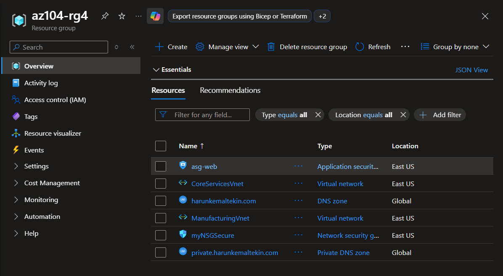
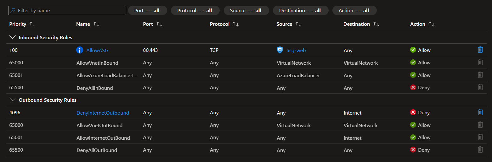
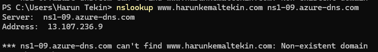

# Lab 04: Implement Virtual Networking and DNS Infrastructure

## 📌 Project Overview
Establishing a secure, scalable network topology is fundamental to cloud design. In this lab, I implemented enterprise network segmentation, applied structural firewalls via **Network Security Groups (NSGs)** and **Application Security Groups (ASGs)**, and configured hybrid DNS architectures using both public and private Azure DNS Zones.

---

## 🏗️ Core Networking Topology
The network infrastructure introduces two logically separated regional environments mapped for enterprise growth constraints:

* **CoreServicesVnet (`10.20.0.0/16`):**
    * `SharedServicesSubnet` (`10.20.10.0/24`) — Host for common shared workloads (Attached to `myNSGSecure`).
    * `DatabaseSubnet` (`10.20.20.0/24`) — Dedicated database tier boundary.
* **ManufacturingVnet (`10.30.0.0/16`):**
    * `SensorSubnet1` (`10.30.20.0/24`) — Automated IoT/Sensor input tier 1.
    * `SensorSubnet2` (`10.30.21.0/24`) — Automated IoT/Sensor input tier 2.

---

## 🛠️ Skills and Tasks Demonstrated

### Task 1 & 2: Infrastructure as Code (IaC) Network Provisioning
* **Portal-Driven Core:** Provisioned `CoreServicesVnet` and subnets manually using the Azure Portal to establish baseline routing.
* **Template Reusability:** Exported the deployment configuration into ARM JSON structure, refactored the CIDR blocks and naming tokens, and instantly deployed `ManufacturingVnet` using **Custom Template Deployment** to demonstrate environment replication.

### Task 3: Granular Network Micro-Segmentation (ASG & NSG)
* **Application Security Group (`asg-web`):** Provisioned an ASG to logically bundle web workloads independent of individual IP addresses.
* **Inbound Control:** Bound `myNSGSecure` to the Shared Services subnet. Created an inbound rule (`Priority: 100`) allowing only TCP traffic on web ports `80, 443` originating specifically from endpoints inside `asg-web`.
* **Zero-Trust Outbound Block:** Injected a high-priority egress override rule (`Priority: 4096`) targeting the `Internet` Service Tag with a hard **Deny** action, enforcing a strict internal-only egress pattern.

### Task 4: Hybrid Name Resolution (Public & Private DNS Zones)
* **Public Resolution:** Deployed a custom public DNS zone. Created an external `A Record` for `www` resolving to a sample frontend ip. Validated successful end-to-end lookup utilizing external authoritative name servers via `nslookup`.
* **Private Resolution:** Deployed a **Private DNS Zone** (`private.contoso.com`) and securely bound it to `ManufacturingVnet` via a **Virtual Network Link**. Added internal `A Records` to simulate isolated name resolution for internal manufacturing nodes.

---

## 📸 Verification & Proof of Concept (PoC)

### 1. Multi-VNet Infrastructure Map
*Verification showing both VNets successfully created and distinct address spaces isolated safely.*

### 2. Network Security Group Inbound & Outbound Policies
*The active rules view of myNSGSecure showing the explicit port 80/443 allow rule and the complete Internet block.*

### 3. Authoritative Name Resolution (nslookup Proof)
*Terminal output capturing successful name resolution of the public domain target using the designated Azure Name Server instance.*

---

## 🧠 Key Takeaways & Lessons Learned
* **ASG vs. IP Hardcoding:** Hardcoding static IPs inside firewall rules is an administrative anti-pattern. **Application Security Groups (ASGs)** decouple security policies from network topology, allowing you to scale out virtual machinery under a tag without rewriting NSG firewall rules.
* **Outbound Internet Block Constraints:** Applying a complete `Deny` block to the `Internet` service tag stops most outbound leakage, but be cautious: it can break localized system updates, monitoring telemetry, or native extension downloads unless proper service endpoints or NAT gateways are present.
* **Private DNS Isolation:** Unlike Public DNS, Private Azure DNS requires explicit **Virtual Network Links** to function. Devices inside unlinked VNets cannot resolve these zones, keeping internal server namespaces completely safe from outer discovery.