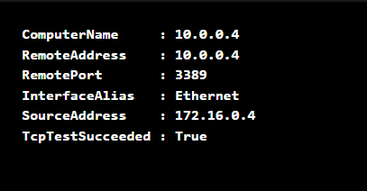
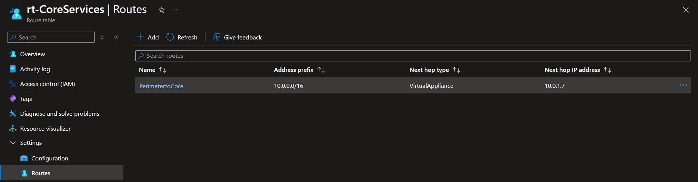

# Lab 05: Implement Intersite Connectivity and Custom Routing

## 📌 Project Overview
In enterprise cloud topologies, keeping infrastructure environments segmented (e.g., Core Services vs. Manufacturing) is a security mandate. However, controlled cross-communication is often required. In this lab, I architected secure, high-speed mesh networks using **Virtual Network Peering** and gained granular control over routing paths by introducing **Custom Route Tables (User-Defined Routes - UDR)**.

---

## 🏗️ Architecture & Network Layout
The environment consists of two independently routed networks deployed within the same region:

* **CoreServicesVnet (`10.0.0.0/16`):**
    * `CoreSubnet` (`10.0.0.0/24`) — Houses corporate shared machines (`CoreServicesVM`).
    * `perimeter` (`10.0.1.0/24`) — A newly designated DMZ/Perimeter subnet for future firewall appliances.
* **ManufacturingVnet (`172.16.0.0/16`):**
    * `ManufacturingSubnet` (`172.16.0.0/24`) — Houses plant machinery systems (`ManufacturingVM`).

---

## 🛠️ Skills and Tasks Demonstrated

### Task 1, 2 & 3: Isolated Workload Provisioning & Connection Auditing
* Provisioned two isolated virtual machine environments (`CoreServicesVM` and `ManufacturingVM`) wrapped within distinct address schemes.
* Utilized **Network Watcher: Connection Troubleshoot** to audit explicit TCP Port `3389` routing. 
* **Initial Status:** The connectivity state returned `Unreachable`, validating that Azure VNets maintain isolation boundaries by default.

### Task 4 & 5: Mesh Networking via VNet Peering
* Established a bidirectional **Virtual Network Peering** link between `CoreServicesVnet` and `ManufacturingVnet`.
* Configured forwarded traffic allowance parameters on both links to transition the operational peering state to `Connected`.
* **Validation Execution:** Enabled RDP firewall visibility inside `CoreServicesVM` and executed a local `Test-NetConnection` pipeline inside `ManufacturingVM` via Azure RunCommand.
* **Peered Status:** The network check successfully returned `TcpTestSucceeded: True`.

### Task 6: Granular Egress Interception (User-Defined Routes)
* Provisioned a custom **Route Table** named `rt-CoreServices`.
* Injected a custom **User-Defined Route (UDR)** named `PerimetertoCore`:
    * *Destination IP Space:* `10.0.0.0/16`
    * *Next Hop Type:* **Virtual Appliance**
    * *Next Hop Address:* `10.0.1.7` (Designated placeholder ip for a future Network Virtual Appliance / Firewall).
* Associated the custom route layout explicitly to the `perimeter` subnet to intercept and force traffic redirection.

---

## 📸 Verification & Proof of Concept (PoC)

### 1. Verification of VNet Peering Connectivity
*The terminal execution showing successful cross-VNet ping/port communication between the two separated spaces after configuring peering.*

### 2. Custom Route Table & UDR Binding
*The final configuration page displaying the user-defined route that overrides Azure's default system routing.*

---

## 🧠 Key Takeaways & Lessons Learned
* **Peering Non-Transitivity Constraint:** By default, Virtual Network Peering is *non-transitive*. If `VNet-A` is peered with `VNet-B`, and `VNet-B` is peered with `VNet-C`, `VNet-A` and `VNet-C` cannot communicate automatically. To establish full connectivity, you must either deploy a direct peering link between them or implement a transit gateway architecture using Network Virtual Appliances (NVAs) with **"Allow forwarded traffic"** enabled.
* **System Routes vs. User-Defined Routes (UDR):** Azure automatically injects default system routes to handle seamless traffic flows between subnets and virtual networks. However, to enforce corporate security policies—such as inspecting egress internet traffic or deep-filtering spoke-to-spoke packets—you must explicitly override these default behaviors by binding custom **User-Defined Routes (UDR)** through local Route Tables.