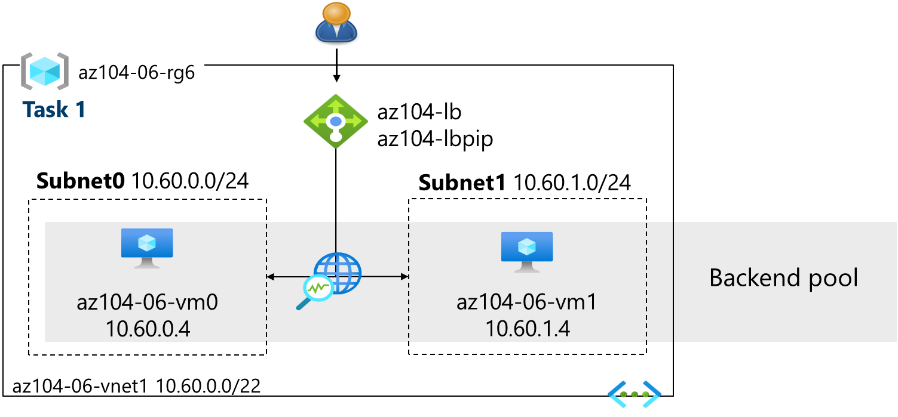
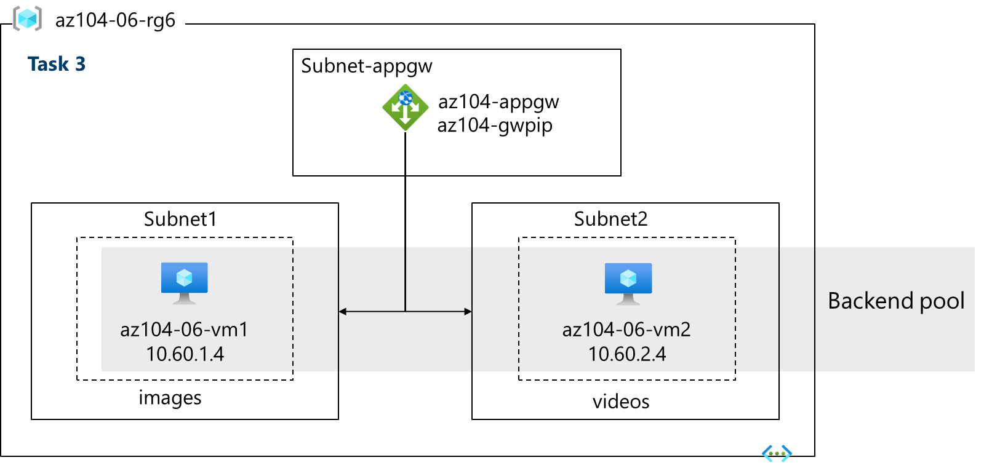
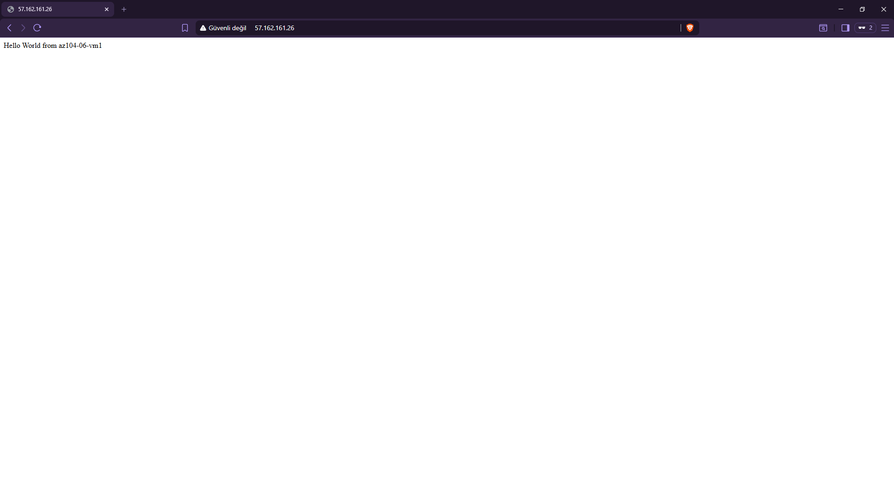
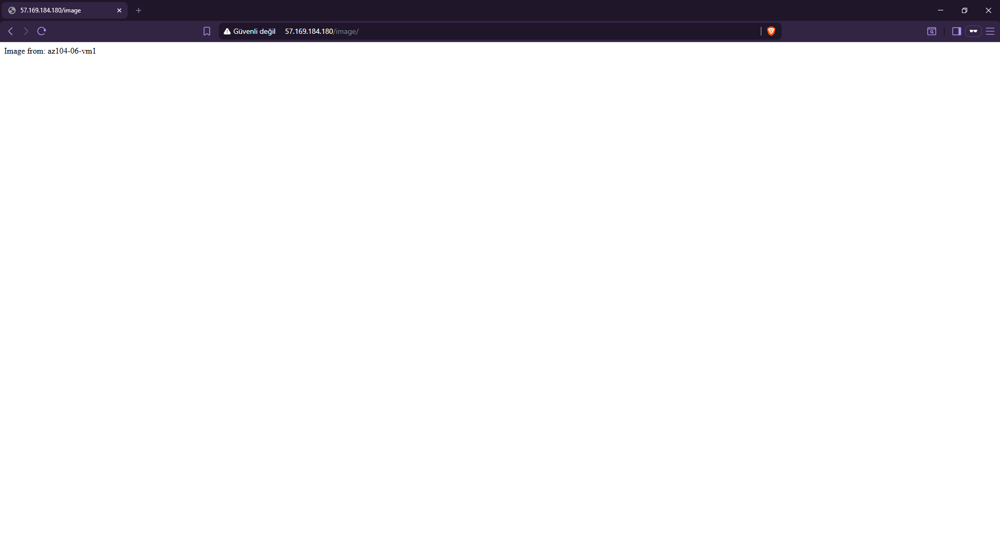

# Lab 06: Implementing Network Traffic Management (Azure Load Balancer & Application Gateway)

## 📌 Executive Summary & Architecture Overview
In this lab, I implemented a multi-tier load-balancing architecture using both **Layer 4 (Azure Load Balancer)** and **Layer 7 (Azure Application Gateway)** components in Microsoft Azure.

The objective was to manage and route incoming public internet traffic across multiple backend Virtual Machines based on transport-level metrics as well as application-level URL paths (`/image/*` vs `/video/*`).

### Key Architecture Highlights
* **Layer 4 Load Balancing:** Distributed HTTP traffic across stateless frontend compute nodes (`vm0` and `vm1`) using a Public Standard Load Balancer.
* **Layer 7 Application Routing:** Implemented path-based routing via Azure Application Gateway to direct `/image/*` requests to `vm1` and `/video/*` requests to `vm2`.
* **Dedicated Gateway Subnet:** Provisioned a isolated `/27` subnet specifically for Application Gateway deployment to satisfy Azure platform requirements.

---

## 📐 Network Architecture Diagrams

### 1. Azure Load Balancer (Layer 4)

### 2. Azure Application Gateway (Layer 7 - Path-Based Routing)

---

## 🛠️ Implementation Steps & Key Configurations

### Task 1: Infrastructure Provisioning
Deployed the base infrastructure using ARM templates containing:
* `az104-06-vnet1` Virtual Network with three workloads subnets.
* `az104-06-vm0`, `az104-06-vm1`, and `az104-06-vm2` deployed across separate subnets.

### Task 2: Azure Load Balancer Configuration
1. **Public IP & Frontend:** Created a Standard Public IP (`az104-lbpip`) assigned to `az104-fe`.
2. **Backend Pool:** Configured `az104-be` targeting NICs of `vm0` and `vm1`.
3. **Health Probe:** Configured TCP Health Probe on Port 80 with a 5-second interval.
4. **Load Balancing Rule:** Bound Port 80 (TCP) from frontend to backend pool.

### Task 3: Azure Application Gateway Configuration
1. **Subnet Delegation:** Provisioned `subnet-appgw` (`10.60.3.224/27`) inside `az104-06-vnet1`.
2. **Frontend & Pools:**
   * Default Pool: `az104-appgwbe` (`vm1` + `vm2`)
   * Image Pool: `az104-imagebe` (`vm1` - `10.60.1.4`)
   * Video Pool: `az104-videobe` (`vm2` - `10.60.2.4`)
3. **Path-Based Routing Rules:**
   * Target Path `/image/*` ➔ Routed to `az104-imagebe`
   * Target Path `/video/*` ➔ Routed to `az104-videobe`

---

## 🧪 Verification & Testing Results

### Test 1: Layer 4 Round-Robin Verification
Navigating to the Load Balancer Frontend Public IP (`http://<LB-Public-IP>`) and refreshing the browser confirmed load distribution between nodes:

| Request 1 (`vm0`) | Request 2 (`vm1`) |
|---|---|
|  |  |

---

### Test 2: Layer 7 Path-Based Routing Verification
Accessing the Application Gateway Public IP with path extensions verified traffic isolation:

* **URL:** `http://<AppGW-Public-IP>/image/` ➔ Directed to **VM1** (`az104-imagebe`)
  

* **URL:** `http://<AppGW-Public-IP>/video/` ➔ Directed to **VM2** (`az104-videobe`)
  

---

## 🧠 Key Takeaways & Lessons Learned

* **L4 vs. L7 Load Balancing Decision:**
  * **Azure Load Balancer (L4):** Operates purely at the transport layer (IP/Port). It cannot inspect payload or HTTP headers, making it ultra-fast with extremely low latency.
  * **Azure Application Gateway (L7):** Operates at the application layer. It enables advanced features like URL path-based routing, SSL termination/offloading, Cookie-based session affinity, and Web Application Firewall (WAF) integration.
* **Dedicated Gateway Subnet Constraint:** Application Gateway requires a dedicated subnet (minimum `/27` prefix) with no other workloads/VMs residing inside it.
* **Health Probe Behavior:** Both load balancers continuously poll backend nodes. If a backend node fails consecutive health checks, traffic is dynamically rerouted to healthy nodes to maintain high availability.