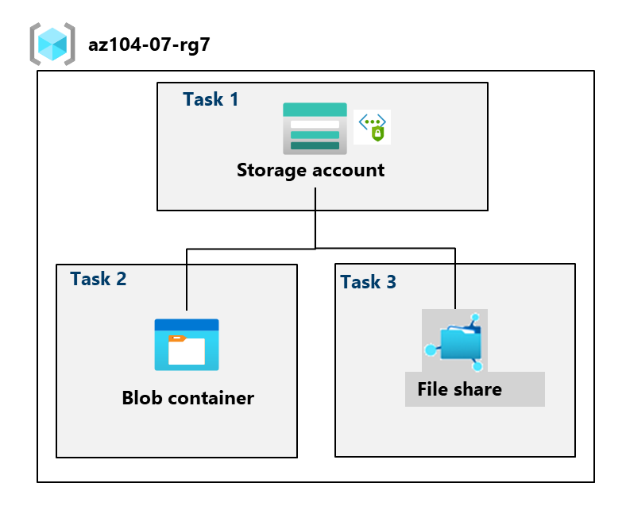
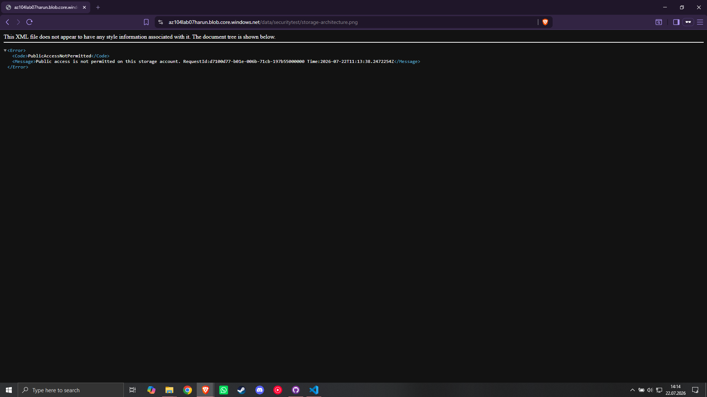

# Lab 07: Managing Azure Storage Accounts, Blobs, File Shares & Security

## 📌 Executive Summary & Architecture Overview
In this lab, I provisioned and secured **Azure Storage Accounts** to manage both unstructured data (Azure Blobs) and SMB/REST file shares (Azure Files). 

The primary focus was establishing end-to-end storage governance, implementing cost-optimization policies, enforcing data immutability, managing granular identity and token-based access, and restricting network perimeters using **Virtual Network Service Endpoints**.

### Key Architecture Highlights
* **Storage Account Provisioning:** Configured a Geo-Redundant Storage (GRS) account with public network restrictions and automated lifecycle management rules.
* **Data Immutability & Lifecycle Rules:** Enforced a **Time-based Retention Policy** (180 days) for regulatory compliance and created a Lifecycle Management rule (`Movetocool`) to transition idle blobs to the Cool Access Tier after 30 days.
* **Identity & Token Security:** Granted RBAC permissions (`Storage Blob Data Contributor`) and generated limited-scope **User Delegation Shared Access Signatures (SAS)** for secure, non-public blob retrieval.
* **Network Perimeter Hardening:** Restricted access to the storage account to a dedicated Azure VNet (`vnet1`) using **Microsoft.Storage Service Endpoints**, revoking all direct public IP access.

---

## 📐 Network & Storage Security Architecture



---

## 🛠️ Implementation Steps & Key Configurations

### Task 1: Create and Configure a Storage Account
1. **Provisioning:** Created Standard GRS Storage Account in `East US` under Resource Group `az104-rg7`.
2. **Network Control:** Configured initial firewall to allow traffic only from selected networks (Client Public IP).
3. **Automated Tiering (Lifecycle Management):**
   * **Rule Name:** `Movetocool`
   * **Action:** If base blobs are not modified for **> 30 days**, automatically move them to **Cool Storage**.

### Task 2: Configure Secure Blob Storage & Immutability
1. **Container Setup:** Created a private container named `data`.
2. **Immutability Policy:** Added a **Time-based retention policy** set to **180 days** (preventing deletion/modification).
3. **IAM & Role Assignment:** Assigned `Storage Blob Data Contributor` and `Storage File Data Privileged Contributor` roles to the current admin user.
4. **Data Upload:** Uploaded test payload into `/securitytest` virtual directory as a **Hot Block Blob** (4 MiB block size).
5. **Delegated Access Control:** Generated a **User Delegation SAS Token** with `Read` permissions valid for 24 hours.

### Task 3: Azure Files & Network Service Endpoint Hardening
1. **Azure Files:** Created an SMB/REST file share named `share1` using Transaction Optimized tier.
2. **Storage Browser Operations:** Uploaded content via Azure Portal Storage Browser.
3. **VNet & Service Endpoint Configuration:**
   * Created Virtual Network `vnet1` with default subnet.
   * Enabled Service Endpoint: `Microsoft.Storage` on `vnet1/default`.
   * **Firewall Hardening:** Added `vnet1` to Storage Account Allowed Networks and **removed the Client Public IP**.

---

## 🧪 Verification & Security Testing Results

### Test 1: Direct Public Blob Access (Access Denied)
Navigating directly to the public Blob URL (`https://<storage-account>.blob.core.windows.net/data/securitytest/file.jpg`) in an InPrivate window resulted in expected authorization failure:



```xml
<Error>
  <Code>ResourceNotFound</Code>
  <Message>The specified resource does not exist.</Message>
</Error>