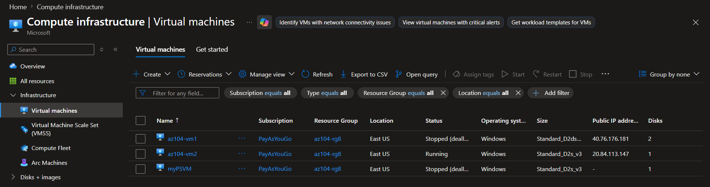
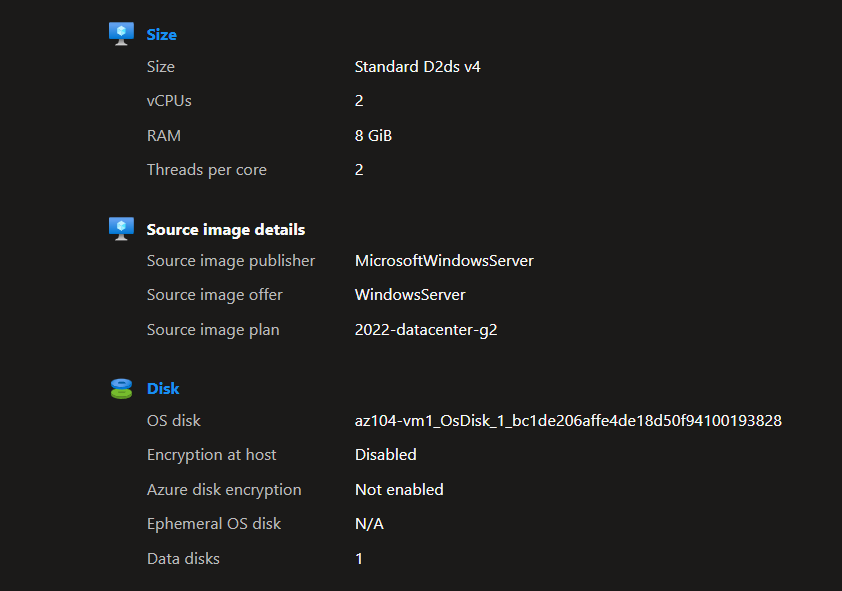
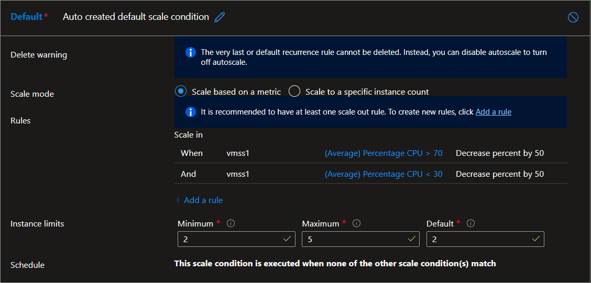
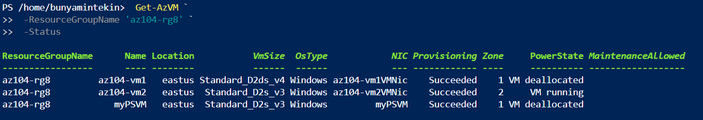

# Lab 08: Manage Virtual Machines and Scale Sets

## 📌 Project Overview
In this lab, I explored compute scalability and high availability solutions in Azure by deploying and managing Azure Virtual Machines (VMs) and Virtual Machine Scale Sets (VMSS). The objective was to configure zone-resilient virtual machines, perform compute/storage scaling operations, and establish automated metric-based horizontal autoscaling using Azure VMSS, PowerShell, and Azure CLI.

## 🏗️ Architecture & Component Design
The compute architecture consists of the following components:
*   **Availability Zones:** High availability deployment distributing resources across Zone 1, Zone 2, and Zone 3 in `East US` for 99.99% uptime SLA.
*   **Virtual Machines (`az104-vm1`, `az104-vm2`):** Zone-resilient Windows Server 2025 compute instances with detached/attached managed disks.
*   **Virtual Machine Scale Set (`vmss1`):** A uniform scale set integrated with an Azure Load Balancer (`vmss-lb`) and Network Security Group (`vmss1-nsg`) permitting HTTP traffic.
*   **Autoscale Rules:** Dynamic metric-triggered conditions (CPU > 70% scale out by 50%, CPU < 30% scale in by 50%) constrained within 2 to 10 instance limits.
*   **Cross-Interface Provisioning:** Additional VMs (`myPSVM`, `myCLIVM`) deployed using Azure PowerShell and Azure CLI via Cloud Shell.

---

## 🛠️ Skills and Tasks Demonstrated

### Task 1: Zone-Resilient Virtual Machine Deployment
*   **High Availability Configuration:** Provisioned two Windows Server 2025 VMs across distinct Availability Zones (Zone 1 & Zone 2) within `az104-rg8`.
*   **Resource Independence:** Configured network interfaces, OS disks, and storage profiles with standard security settings and no public load balancer dependency.

### Task 2: Compute and Storage Vertical Scaling
*   **Compute Resizing:** Deallocated `az104-vm1` and dynamically scaled its compute SKU up to `Standard_D2ds_v4`.
*   **Data Disk Lifecycle:** Provisioned a 32 GiB data disk (`vm1-disk1`), detached it from the VM, upgraded its performance tier from Standard HDD to Standard SSD, and reattached it to the compute instance.

### Task 3 & 4: Virtual Machine Scale Sets & Metric-Based Autoscaling
*   **VMSS Architecture:** Deployed `vmss1` across Zones 1, 2, and 3 with custom virtual network (`10.82.0.0/20`), NSG allowing HTTP (Port 80), and an integrated Azure Load Balancer (`vmss-lb`).
*   **Custom Autoscale Rules:**
    *   **Scale Out:** Triggers when average CPU usage exceeds **70% over 10 minutes** -> Increases instance count by **50%** (5 min cool-down).
    *   **Scale In:** Triggers when average CPU usage drops below **30% over 10 minutes** -> Decreases instance count by **50%**.
    *   **Instance Governance:** Constrained instance count limits to **Min: 2, Max: 10, Default: 2**.

### Task 5 & 6: Automated Compute Provisioning (PowerShell & CLI)
*   **Azure PowerShell Deployment:** Executed `New-AzVm` to spin up `myPSVM` in Zone 1, queried status using `Get-AzVM`, and cleanly deallocated compute resources with `Stop-AzVM`.
*   **Azure CLI Infrastructure:** Generated Linux VM `myCLIVM` using `az vm create` with automated SSH key creation, validated `powerState` via `az vm show`, and deallocated compute using `az vm deallocate`.

---

## 📸 Verification & Proof of Concept (PoC)

Here is the confirmation of successful resource deployment and operational scaling within the Azure portal:

### 1. Zone-Resilient VMs and Scale Set Overview
*Below, you can see all virtual machines (`az104-vm1`, `az104-vm2`, `myPSVM`, `myCLIVM`) and the scale set (`vmss1`) successfully running in the `az104-rg8` resource group.*

### 2. VM Resizing & Disk Performance Upgrade
*This screenshot confirms the updated SKU size (`Standard_D2ds_v4`) and the reattached `vm1-disk1` upgraded to Standard SSD performance.*

### 3. Autoscale Metric Rules Configuration
*Below is the configured autoscale setting for `vmss1`, showcasing metric-based triggers for CPU scale-out (>70%) and scale-in (<30%) with instance bounds.*

### 4. PowerShell & CLI Provisioning Validation
*Terminal output showing successful creation and deallocation status for `myPSVM` and `myCLIVM` via Azure Cloud Shell.*

---

## 🧠 Key Takeaways & Lessons Learned
*   **Cost Optimization via Deallocation:** When stopping virtual machines, explicitly confirming `Deallocated` state is critical; simply shutting down the OS keeps compute billing active, whereas deallocation releases compute allocations and public IPs.
*   **Storage Modification Workflow:** Upgrading a managed disk's performance tier (e.g., HDD to SSD) can require detaching the disk or stopping the VM depending on disk type constraints. Detaching retains the data object independently in Azure storage.
*   **Scale Out Mechanics:** Using percentage-based scaling (e.g., "Increase percent by 50%") on scale sets provides smoother elasticity compared to fixed count increases when managing large-scale, dynamically fluctuating workloads.