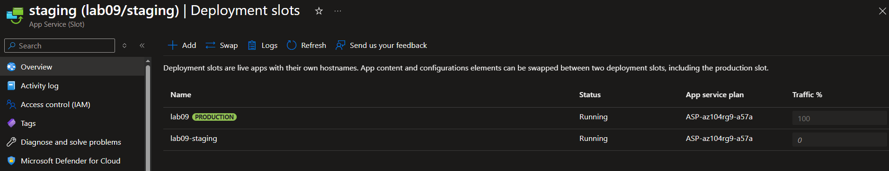
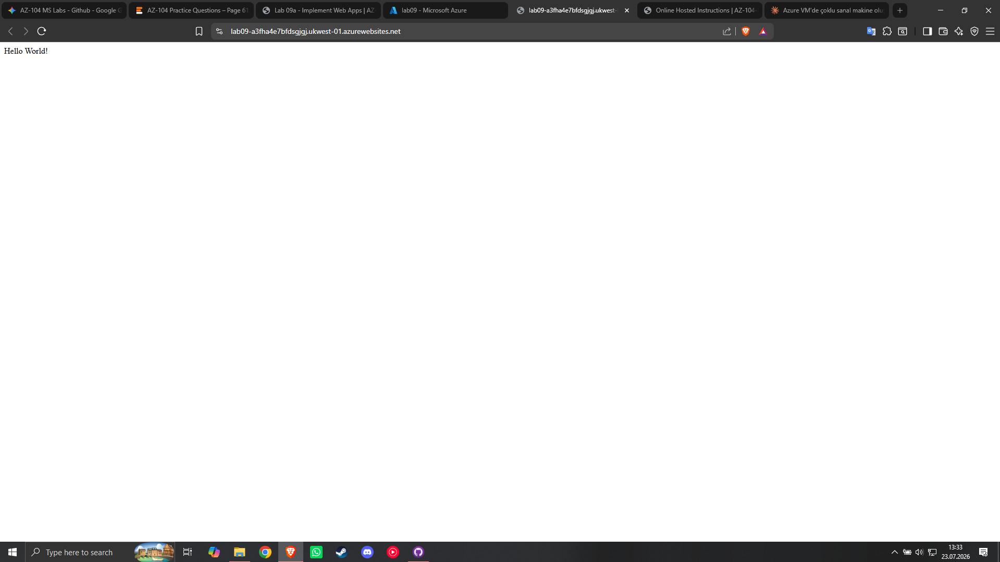
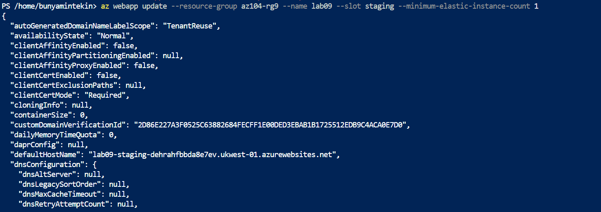
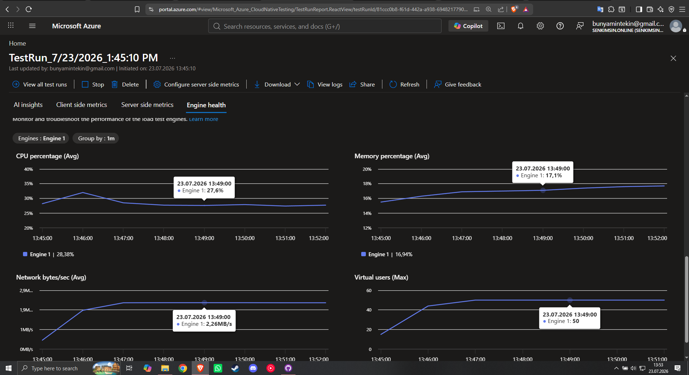

# Lab 09a: Implement and Scale Azure Web Apps

## 📌 Project Overview
In this lab, I implemented a scalable, highly available web application infrastructure using Azure App Services (PaaS). The primary objective was to modernize an existing on-premises legacy workload by deploying a Linux-based PHP 8.2 web app, establishing zero-downtime deployment pipelines using deployment slots (`staging` to `production` swap), and validating automated horizontal elasticity with Azure Load Testing.

## 🏗️ Architecture & Component Design
The web application architecture consists of the following components:
*   **App Service Plan (Premium V3 P1V3):** The underlying PaaS compute container providing Linux runtime resources in `East US`.
*   **Production Deployment Slot:** The main web app endpoint hosting public production traffic.
*   **Staging Deployment Slot:** An isolated environment configured with SCM Basic Authentication and linked to an external GitHub repository (`php-docs-hello-world`) for continuous deployment and pre-production validation.
*   **Automatic Scaling Engine:** Autoscale profile set with bounds (Min: 1, Max Burst: 2 instances) and synchronized with staging minimum elastic instances via Azure CLI.
*   **Azure Load Testing:** A cloud-native load generator used to simulate HTTP traffic requests and evaluate live metric telemetry.

---

## 🛠️ Skills and Tasks Demonstrated

### Task 1: PaaS Web App Provisioning
*   **App Service Creation:** Provisioned an Azure Web App on a Premium V3 P1V3 App Service Plan running a PHP 8.2 runtime stack on Linux within resource group `az104-rg9`.

### Task 2 & 3: Isolated Deployment Slot & Continuous Deployment Pipeline
*   **Staging Environment:** Created a dedicated `staging` slot without cloning production settings to maintain strict isolation.
*   **CI/CD Configuration:** Enabled SCM Basic Auth Publishing Credentials and connected the staging deployment center to an external Git source (`https://github.com/Azure-Samples/php-docs-hello-world`, branch: `master`).
*   **Pre-Production Verification:** Validated code deployment directly via the unique staging slot URL before exposing changes to end users.

### Task 4: Zero-Downtime Deployment Slot Swap
*   **Production Release:** Executed an in-place deployment slot swap between `staging` and `production`.
*   **Traffic Transition:** Verified that the production default domain seamlessly cut over to display the newly deployed application without service disruption.

### Task 5: Elastic Autoscaling & Cloud Load Testing Validation
*   **Elastic Scale Out Rules:** Configured Automatic Scale Out on the production App Service Plan with a maximum burst limit of 2 instances and a minimum of 1 instance.
*   **CLI Synchronization:** Executed `az webapp update` in Azure Cloud Shell to align the staging slot's `--minimum-elastic-instance-count` to 1, preventing capacity conflicts.
*   **Load Test Simulation:** Provisioned an Azure Load Testing resource to generate synthetic HTTP request loads against the web app URL, monitoring real-time metrics including virtual users, response time, and requests/sec.

---

## 📸 Verification & Proof of Concept (PoC)

Here is the confirmation of successful application deployment, slot swapping, and scale-out testing:

### 1. App Service & Deployment Slots Overview
*Below, you can see both the production web app and the dedicated staging deployment slot listed and running in the Azure Portal.*

### 2. Staging & Production Code Verification (Post-Swap)
*This screenshot confirms the successful execution of the deployment slot swap, with the production URL serving the deployed PHP application.*

### 3. Automatic Scaling & CLI Configuration
*Below is the scale-out configuration along with the executed Azure CLI command in Cloud Shell updating the staging slot's minimum elastic instance count.*

### 4. Azure Load Testing Telemetry
*Live metrics dashboard showing simulated traffic generation (Virtual users, Requests/sec, and Response time) against the App Service endpoint.*

---

## 🧠 Key Takeaways & Lessons Learned
*   **Zero-Downtime Deployments:** Utilizing deployment slots allows testing in an identical environment before swapping to production. Swapping instantly redirects traffic via VIP (Virtual IP) rotation without needing code recompilation or application downtime.
*   **Staging & Elastic Scale Constraints:** When applying automatic scaling rules on App Service plans with multiple deployment slots, explicit resource limits (such as `--minimum-elastic-instance-count`) must be configured via CLI for secondary slots to ensure smooth scaling operations.
*   **PaaS Cost Efficiency:** Moving legacy on-premises web workloads (e.g., PHP on Windows) to Azure Web Apps on Linux eliminates hardware lifecycle overhead while introducing native cloud elasticity and automated CI/CD capabilities.